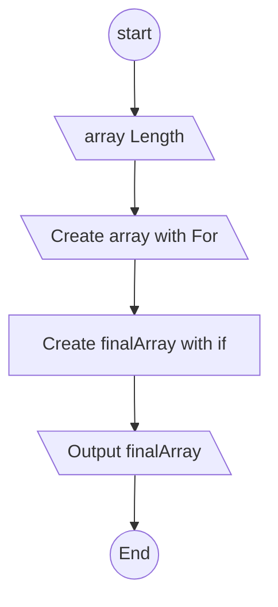

# FinalWork

Задача:Написать код,который из имеющегося массива сделает массив,длина элементов которого не превышает 3.

1.Пользователь вводит с консоли размер массива .

2.Пользователь вводит с консоли элементы массива.

3.С помощью метода через цикл for из полученных данных создаем массив .

4. Полученный массив отправляем в метод,где с помощью условия if создаем нужный нам массив.

5. Выводим полученный массив на консоль.

Упрощеная Блок-схема

